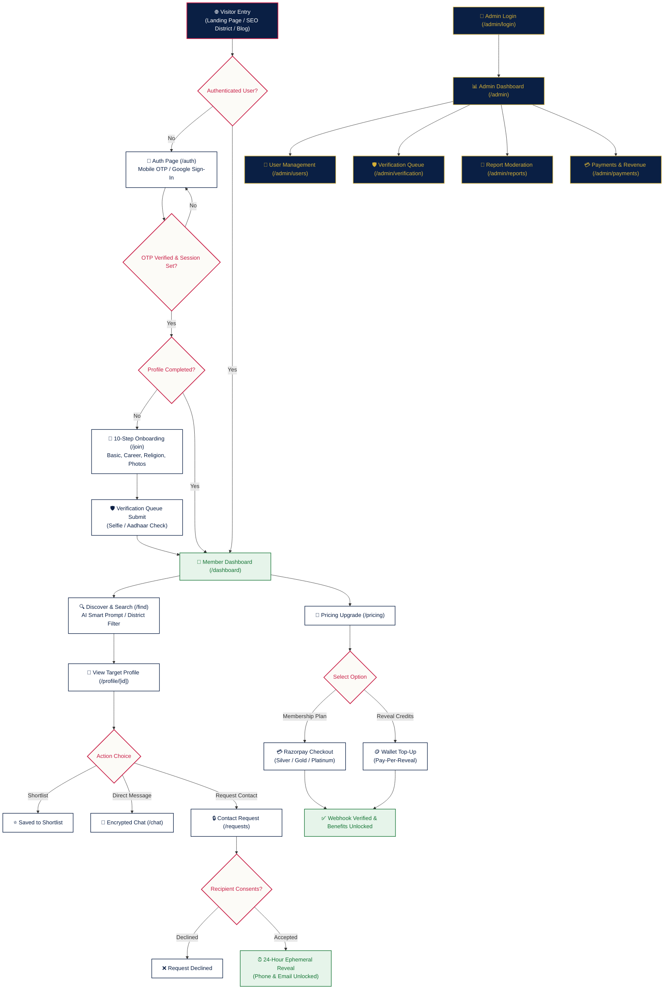
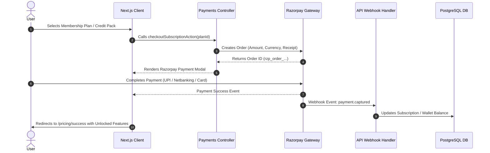
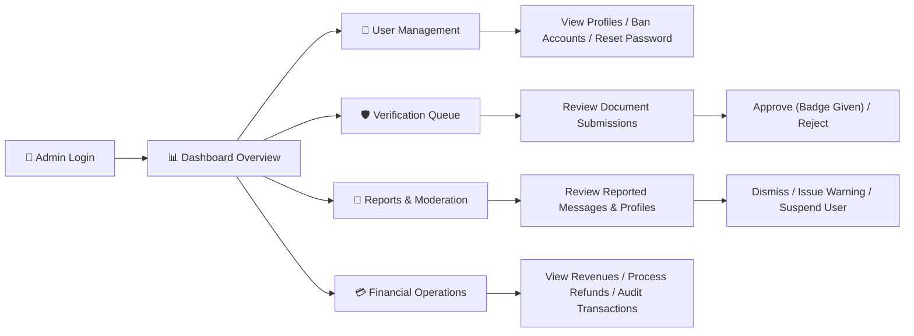

# KeralamMatch — End-to-End Application Flowchart & Architecture

This document provides a comprehensive end-to-end flowchart detailing all user, matching, payment, and administrative workflows in **KeralamMatch**.

---

## 1. High-Level System Architecture & User Journey

---

## 2. Detailed Technical Workflows

### A. Authentication & Onboarding Workflow

1. **User Auth Phase (`/auth`)**:
   - User inputs 10-digit Indian Mobile Number or selects Google OAuth.
   - System triggers Firebase OTP delivery to phone.
   - Upon verification, backend creates encrypted HTTP-only session cookie (`km_session`).

2. **10-Step Onboarding Phase (`/join`)**:
   - **Step 1**: Basic Info (Name, DOB, Gender, Created For).
   - **Step 2**: Physical Attributes (Height, Complexion, Body Type).
   - **Step 3**: Religion & Community (Religion, Caste, Star/Horoscope).
   - **Step 4**: Education & Career (Degree, Institution, Occupation, Income).
   - **Step 5**: Location & District (State, District, City, Native Place).
   - **Step 6**: Family Background (Family Type, Status, Values, Parents).
   - **Step 7**: Lifestyle & Habits (Diet, Smoking, Drinking).
   - **Step 8**: Partner Preferences (Age Range, Height, Religion, District).
   - **Step 9**: Profile Photo Upload (Cloudinary storage integration).
   - **Step 10**: Liveness & ID Verification Submission (Selfie + Aadhaar).

---

### B. Matching Engine & Ephemeral Contact Reveal Workflow

1. **Matching & Discovery (`/find`)**:
   - Client executes quick filters (Religion, Caste, Location) or AI Natural Language Query (e.g. *"Software engineer from Ernakulam preferring vegetarian diet"*).
   - Backend processes search filters and calculates **Compatibility Score (%)** based on 12 key attributes.

2. **24-Hour Ephemeral Contact Reveal (`/requests`, `/profile/[id]`)**:
   - Candidate A clicks **"Send Contact Request"** on Candidate B's profile.
   - Candidate B receives real-time notification (`/notifications`) and email alert.
   - Candidate B reviews profile and clicks **"Accept"**.
   - System encrypts timestamp (`expiresAt = now + 24 hours`).
   - For exactly 24 hours, Candidate A and Candidate B can decrypt and view candidate phone number & email.
   - At $t > 24\text{ hours}$, credentials auto-lock and revert to masked state.

---

### C. Payment & Razorpay Gateway Workflow

---

### D. Admin Portal & Safety Moderation Workflow

---

## 3. Summary of System Routes & Architecture Layers

| Layer | Component | Target Routes / Functions |
|---|---|---|
| **Public & SEO** | Landing, SEO, Blog | `/`, `/find/brides-in-[district]`, `/find/[community]-matrimony`, `/blog`, `/trust` |
| **Authentication** | Auth & Session | `/auth`, `/api/auth/session`, `/api/auth/logout` |
| **User Application** | Core Portal | `/join`, `/dashboard`, `/find`, `/profile/[id]`, `/chat`, `/requests`, `/notifications` |
| **Monetization** | Payments & Subscriptions | `/pricing`, `/pricing/success`, `/api/payments/razorpay/webhook` |
| **Admin Portal** | System Management | `/admin/login`, `/admin`, `/admin/users`, `/admin/verification`, `/admin/reports`, `/admin/payments`, `/admin/blog`, `/admin/faq`, `/admin/audit`, `/admin/settings` |

---

*Document generated for KeralamMatch Platform Architecture.*
