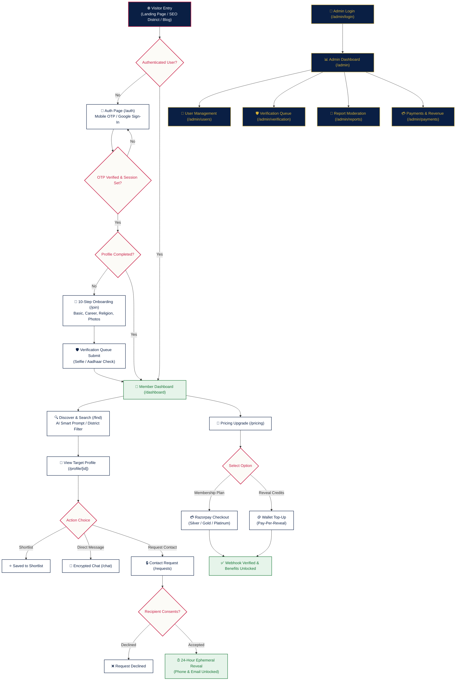

# KeralamMatch — End-to-End Platform Documentation & Technology Roadmap

## 1. Executive Summary & Product Vision

**KeralamMatch** is Kerala's premier privacy-first, verified matrimonial platform designed for the global Malayali community. Unlike legacy matrimonial portals that publicly expose candidate phone numbers, photos, and personal details to search engines or anonymous browsers, KeralamMatch enforces **Consent-Based Ephemeral 24-Hour Contact Reveals**, **AES-256 Encrypted Storage**, **Multi-Layer Identity Verification**, and **AI-Assisted Compatibility Matching**.

---

## 2. Current Platforms & Technology Stack (Used Now)

```
┌─────────────────────────────────────────────────────────────────────────────┐
│                            FRONTEND LAYER                                   │
│ Next.js 16 (App Router) · React 19 · TypeScript Strict · Tailwind CSS v4    │
│ Progressive Web App (PWA) · Lucide Icons · Google Fonts (Inter / Outfit)    │
└──────────────────────┬──────────────────────────────────────────────────────┘
                       │
┌──────────────────────▼──────────────────────────────────────────────────────┐
│                            BACKEND & API LAYER                              │
│ Next.js Server Actions & Route Handlers · Clean Architecture Pattern        │
│ Upstash Redis (Rate Limiting) · Security Headers & CSP Middleware          │
└──────────────────────┬──────────────────────────────────────────────────────┘
                       │
       ┌───────────────┼──────────────────────────────┬────────────────────────┐
       │               │                              │                        │
┌──────▼──────┐ ┌──────▼──────┐               ┌───────▼──────┐         ┌───────▼──────┐
│  DATABASE   │ │    AUTH     │               │   PAYMENTS   │         │    MEDIA     │
│ Neon Postgres│ │Firebase Auth│               │   Razorpay   │         │  Cloudinary  │
│ Prisma ORM  │ │Custom Cookie│               │   Webhooks   │         │ CDN Storage  │
└─────────────┘ └─────────────┘               └──────────────┘         └──────────────┘
```

### A. Core Architecture & Frontend Framework
- **Framework**: **Next.js 16** (App Router with Turbopack).
- **Language**: **TypeScript** (Strict Type Mode enabled).
- **Styling**: **Tailwind CSS v4** with custom design tokens for Warm Ivory (`#FCFBF7`), Deep Navy (`#0A1F44`), Crimson Red (`#C81D45`), and Classic Gold (`#D4AF37`).
- **Icons & UI Components**: **Lucide React Icons**, custom modular UI primitives (`Button`, `Card`, `Input`, `Progress`, `Skeleton`, `Logo`).
- **PWA Infrastructure**: Web App Manifest (`manifest.json`), Service Worker (`sw.js`), and Apple touch icon assets.

### B. Data Layer & Encryption
- **Database**: **Neon PostgreSQL** (Serverless PostgreSQL with SSL encryption).
- **ORM & Migrations**: **Prisma ORM v6**.
- **Field-Level Security**: **AES-256-GCM Encryption** applied to sensitive candidate phone numbers and email addresses at rest before storing in PostgreSQL.

### C. Authentication & Session Management
- **Primary Auth**: **Firebase Authentication** (Supporting Mobile SMS OTP & Google OAuth 2.0).
- **Session Layer**: Encrypted HTTP-only Cookie (`km_session`) with server-side validation.
- **Sandbox Fallback**: Built-in developer sandbox OTP (`123456`) fallback for offline/test environments.

### D. Media & Document Management
- **Cloud Provider**: **Cloudinary CDN**.
- **Capabilities**: Automated image optimization (AVIF/WebP), photo watermarking, facial liveness verification uploads, and voice introduction audio hosting.

### E. Payments & Monetization
- **Payment Gateway**: **Razorpay Payment Gateway API**.
- **Supported Methods**: UPI (Google Pay, PhonePe, Paytm), Netbanking, Debit/Credit Cards.
- **Revenue Models**:
  1. **Membership Subscriptions**: Monthly/Quarterly/Annual plans (`Free`, `Silver`, `Gold`, `Platinum`).
  2. **Pay-Per-Reveal Credit Wallet**: Pay-as-you-go credit refill packs (₹99 for 1 reveal, ₹499 for 5 reveals).
- **Webhook Processing**: Asynchronous webhook handler (`/api/payments/razorpay/webhook`) verifying payment signatures before provisioning wallet credits or membership tiers.

### F. Email Communications
- **Provider**: **Resend API**.
- **Email Templates**: HTML responsive email templates for:
  - Welcome & Onboarding
  - Mobile OTP Verification
  - Contact Request Received (with 24h timer notice)
  - Contact Request Accepted
  - Contact Window Expiring / Expired
  - Membership Upgrade Receipt
  - Security Alert Notifications

### G. Security & Performance Hardening
- **Rate Limiting**: **Upstash Redis** & in-memory sliding window rate-limiter protecting Auth, OTP, Chat, and Request endpoints.
- **Security Headers**: HSTS, Content Security Policy (CSP), X-Frame-Options (SAMEORIGIN), X-Content-Type-Options (nosniff), Referrer-Policy.
- **Admin Chat Privacy Shield**: Architectural restriction preventing administrators from automatically reading un-redacted private user messages without audit logs.

---

## 3. Future Roadmap Platforms & Integrations (Going to be Used)

```
┌─────────────────────────────────────────────────────────────────────────────┐
│                       FUTURE PLATFORMS & INTEGRATIONS                       │
├─────────────────────────────────────────────────────────────────────────────┤
│ 📱 Native Mobile Apps  │ React Native / Expo for iOS App Store & Android     │
│ 🆔 DigiLocker / Govt   │ Automated Instant Aadhaar & Passport Verification    │
│ 💬 WhatsApp Business   │ Direct Notification Delivery via Meta WhatsApp API  │
│ 🧠 AI Vector Matcher   │ OpenAI Embeddings + Pinecone Semantic Search         │
│ 📹 WebRTC Video Dates  │ 1-on-1 Encrypted Virtual Dates via Agora.io         │
│ 🔔 Web & App Push      │ Firebase Cloud Messaging (FCM) Push Notifications   │
└─────────────────────────────────────────────────────────────────────────────┘
```

1. **Native iOS & Android Applications**:
   - **Technology**: **React Native / Expo**.
   - **Purpose**: Native performance, biometrics (FaceID/Fingerprint login), and native device camera integration for photo verification.

2. **Automated Govt ID Verification (DigiLocker / Aadhaar API)**:
   - **Platforms**: **SurePass / Cashfree Verification API / DigiLocker**.
   - **Purpose**: Instant 5-second automated Aadhaar, PAN, and Passport verification with green verified tick badges.

3. **WhatsApp Business API Notifications**:
   - **Platforms**: **Twilio for WhatsApp / Meta WhatsApp Business API**.
   - **Purpose**: Deliver instant WhatsApp alerts when a candidate receives a Contact Request, Chat Message, or when a 24-hour reveal window is about to expire.

4. **AI Vector Search & Astro Compatibility Engine**:
   - **Platforms**: **OpenAI Embeddings / Google Gemini API + Pinecone Vector Database**.
   - **Purpose**: Hyper-personalized semantic candidate matching based on personality traits, career ambitions, lifestyle preferences, and automated Porutham (Malayalam horoscope matching).

5. **In-App WebRTC Privacy Video Calling**:
   - **Platforms**: **Agora.io / Daily.co WebRTC SDK**.
   - **Purpose**: Secure 1-on-1 virtual video dating directly inside the platform without revealing personal phone numbers or social media handles.

6. **Firebase Cloud Messaging (FCM) Push Notifications**:
   - **Platforms**: **FCM & Web Push Service**.
   - **Purpose**: Real-time push notifications on mobile and desktop browsers for incoming messages and match alerts.

---

## 4. Complete End-to-End User & Admin Flow



### A. Visitor Landing & SEO Discovery
- Visitors arrive via the main Landing Page (`/`), District SEO pages (`/find/brides-in-trivandrum`, `/find/brides-in-ernakulam`), Community SEO pages (`/find/nair-matrimony`), or Blog articles (`/blog`).
- Unauthenticated visitors can view masked profiles with blurred media and trust badges.

### B. Authentication & 10-Step Onboarding
1. User clicks **Login / Register** (`/auth`).
2. Enters Indian Mobile Number $\rightarrow$ receives Firebase SMS OTP $\rightarrow$ system sets HTTP-only `km_session` cookie.
3. Redirected to the 10-Step Onboarding Wizard (`/join`):
   - Step 1: Basic Information & Profile Owner
   - Step 2: Physical Attributes & Height
   - Step 3: Religion, Caste & Horoscope Details
   - Step 4: Higher Education, Profession & Annual Income
   - Step 5: Native Place, Current City & District
   - Step 6: Family Values, Status & Background
   - Step 7: Lifestyle & Dietary Habits
   - Step 8: Partner Preferences (Age, Education, Location, Caste)
   - Step 9: Cloudinary Photo & Voice Intro Upload
   - Step 10: Selfie Liveness Check & Aadhaar Upload

### C. Matching, Search & Interaction
1. User lands on Dashboard (`/dashboard`) showing recommendations, profile completion ring, and view metrics.
2. Navigates to Discovery (`/find`): Applies filters (District, Religion, Caste, Education) or enters an AI prompt.
3. Views Candidate Profile (`/profile/[id]`): Inspects attributes, verified checkmarks, match score, and horoscope status.

### D. Consent-Based Ephemeral 24-Hour Contact Reveal
1. Candidate A clicks **"Send Contact Request"**.
2. Candidate B receives real-time notification (`/notifications`) and email alert.
3. Candidate B clicks **"Accept"**.
4. System sets `expiresAt = now + 24 hours` and unlocks decrypted phone number & email for Candidate A and Candidate B.
5. After 24 hours, contact credentials automatically re-lock.

### E. Encrypted Chat & Monetization
1. Matched candidates communicate via the Secure Chat interface (`/chat`).
2. Users upgrade membership or recharge wallet credits via Razorpay (`/pricing`).

### F. Governance & Admin Portal (`/admin/*`)
1. Admin authenticates at `/admin/login`.
2. Admin Dashboard (`/admin`) tracks total users, new registrations, verified profiles, active subscriptions, and revenue graphs.
3. Admin oversees User Management (`/admin/users`), Verification Queue approvals (`/admin/verification`), Report Moderation (`/admin/reports`), Payment Audits (`/admin/payments`), Blog CMS (`/admin/blog`), FAQ Editor (`/admin/faq`), Audit Logs (`/admin/audit`), and System Settings (`/admin/settings`).

---

## 5. Summary Matrix of Routes & Technology Services

| Route | Feature Area | Primary Technology / Platform | Access Level |
|---|---|---|---|
| `/` | Landing Page | Next.js 16, Tailwind CSS v4 | Public |
| `/auth` | Authentication | Firebase Auth, Phone OTP, Google OAuth | Public |
| `/join` | 10-Step Onboarding | Server Actions, Cloudinary SDK | Authenticated |
| `/dashboard` | User Dashboard | Next.js Server Components, Redis | Member |
| `/find` | Search & Discovery | Matching Engine, Prisma ORM | Member |
| `/profile/[id]` | Candidate Profile | AES-256 Decryption, Match Controller | Member |
| `/chat` | Secure Messaging | WebSocket / Encrypted API Handlers | Matched Members |
| `/requests` | Contact Requests | Ephemeral 24h Consent Controller | Member |
| `/notifications` | Notifications | In-App Notification API, Resend Email | Member |
| `/pricing` | Subscriptions & Wallet | Razorpay SDK, Webhook Handler | Member |
| `/settings` | Account Settings | Auth Controller, Password Hash API | Member |
| `/trust` | Trust & Safety | Security Center, Content Policy | Public |
| `/admin/login` | Admin Auth | Admin Session Guard | Public / Admin |
| `/admin/*` | Admin Portal | Dark Navy Layout, Admin APIs | Admin Only |
| `/blog` | Blog Magazine | Dynamic SSG Routes, Metadata API | Public |
| `/find/*` | District & Community SEO | Static Generation (SSG), Sitemap | Public |

---

*Documentation compiled for KeralamMatch Platform.*
